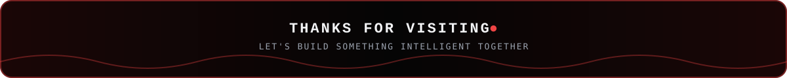

  

  

  
  &nbsp;
  
  &nbsp;
  

  

---

<h2 align="center">🟣 About Me</h2>

  

  

  Hey! I'm <b>Surendar G K</b>, a detail-oriented <b>AI/ML developer</b> and final-year <b>B.E. Artificial Intelligence &amp; Machine Learning</b> student at <b>Acharya Institute of Technology</b>, Bengaluru. 
  I build practical AI solutions with <b>Python, NLP, Computer Vision and Deep Learning</b> — from a dialect-aware medical voice assistant to a UAV-based forest fire and smoke detection system.

  
  &nbsp;
  
  &nbsp;
  
  &nbsp;
  
  &nbsp;
  

  💬 <b>Ask me about:</b> Python, PyTorch, NLP, Computer Vision, YOLO, RAG &amp; LLM integration, Flask and React. 
  📚 <b>Coursework:</b> Machine Learning, NLP, Computer Vision, Deep Learning, Cloud Computing, Generative AI.

<table width="100%" border="0" align="center">
  <tr>
    <td width="50%" align="center" style="padding: 14px;">
      <h4>🔭 Flagship Project</h4>
      
<b>MAAYAVAN</b> AI Medical Voice Assistant

    </td>
    <td width="50%" align="center" style="padding: 14px;">
      <h4>🌱 Current Role</h4>
      
<b>AI/ML Project Developer</b> Acharya Institute of Technology · Aug 2026 – Present

    </td>
  </tr>
  <tr>
    <td width="50%" align="center" style="padding: 14px;">
      <h4>📄 Research</h4>
      
<b>IEEE Conference Paper</b> UAV-Based Early Forest Fire &amp; Smoke Prediction

    </td>
    <td width="50%" align="center" style="padding: 14px;">
      <h4>🤝 Collaboration</h4>
      
<b>AI/ML, NLP &amp; Computer Vision</b> Open to internships and new projects

    </td>
  </tr>
</table>

---

<h2 align="center">🟣 Featured Projects</h2>

<table width="100%" border="0" align="center">
  <tr>
    <td align="center" style="padding: 22px;">
      <h3>🩺 MAAYAVAN — AI Medical Voice Assistant</h3>
      
<i>An AI-powered voice assistant that bridges communication gaps caused by regional dialect differences between patients and doctors.</i>

      

        Dialect-normalizing NLP pipeline: speech-to-text, dialect-to-English translation, symptom extraction, intensity detection, negation handling and medical term mapping, with multilingual TTS replies. 
        <b>85–87%</b> keyword identification accuracy · <b>~80–85%</b> reduction in miscommunication
      

      

        
        
        
        
        
      

    </td>
  </tr>
  <tr>
    <td align="center" style="padding: 22px;">
      <h3>🔥 UAV-Based Early Forest Fire &amp; Smoke Prediction System</h3>
      
<i>A dual-domain framework combining YOLO-based visual fire/smoke detection with a Random Forest model for environmental fire-risk prediction.</i>

      

        YOLO26 trained on <b>46,000</b> augmented images, significantly improving on a DETR baseline · Random Forest risk model with <b>89.5%</b> accuracy (High / Medium / Low) · four-level alert system (ALL CLEAR / WARNING / ALERT / CRITICAL). 
        Presented at an <b>IEEE conference</b>.
      

      

        
        
        
        
        
      

    </td>
  </tr>
  <tr>
    <td align="center" style="padding: 22px;">
      <h3>🎟️ College Fest Platform — Technical Lead</h3>
      
<i>A full-stack event registration platform for the college fest with secure online payments.</i>

      

        Led the technical team, built and deployed the platform with React.js and Node.js, integrated Razorpay for ticket and event-fee collection, and handled live troubleshooting during the fest.
      

      

        
        
        
      

    </td>
  </tr>
</table>

  

---

<h2 align="center">🛠️ Tech Stack &amp; Skills</h2>

  

  
  
  
  
  
  
  
  
  
  
  
  
  

---

<h2 align="center">🏅 Achievements &amp; Certifications</h2>

  📄 <b>IEEE Conference Paper Presentation</b> — UAV-Based Early Forest Fire and Smoke Prediction System

  
  
  
  
   
  
  
  
  

---

<h2 align="center">📊 GitHub Analytics &amp; Activity</h2>

  
  &nbsp;
  

  

  

---

<h2 align="center">⚡ Contribution Journey</h2>

  

---

<h2 align="center">📬 Let's Connect &amp; Collaborate</h2>

<i>Whether you want to talk about AI/ML, NLP, computer vision, or a new project idea — my inbox is always open!</i>

<table border="0" align="center">
  <tr>
    <td align="center" width="220" style="padding: 16px;">
      <a href="https://www.linkedin.com/in/surendar-gk" target="_blank">
        
          
        
      </a>
       
      <b>Professional Network</b>
    </td>
    <td align="center" width="220" style="padding: 16px;">
      <a href="mailto:arosurendar@gmail.com">
        
          
        
      </a>
       
      <b>Direct Collaboration</b>
    </td>
    <td align="center" width="220" style="padding: 16px;">
      <a href="https://github.com/surendar-77" target="_blank">
        
          
        
      </a>
       
      <b>Code &amp; Projects</b>
    </td>
  </tr>
</table>

  

